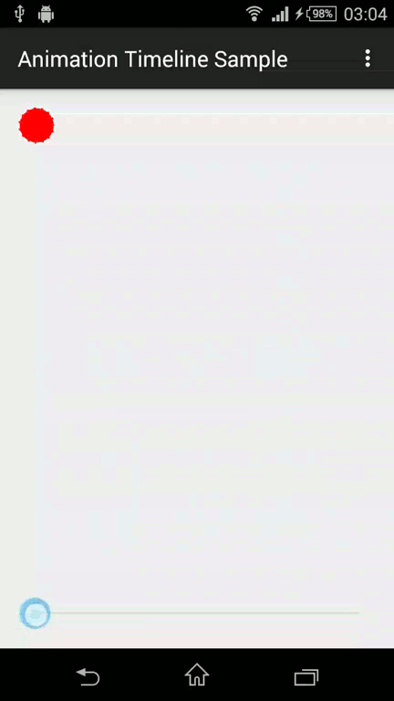

Animation Timeline
---

Take full control over your Android's `AnimatorSet` missed timeline!

A motion picture paints a thousand words over your mind!  

[]


Surely you can use `setCurrentPlayTime` method in `Animator` objects to seek over your animation, but what if you want to seek over `AnimatorSet` objects?  
Then you can use this library with love :)

Features
---
TBA

Usage
---
See the sample project or look at this snippet:  
```java
TimelinedAnimatorSet animatorSet = new TimelinedAnimatorSet();
animatorSet.play(animAlpha).with(animY).after(animX).with(animRot);

animatorSet.seekTimeline(x); // x: anywhere in the timeline from 0.0 to 1.0
```

Donate
---
With money? **No**

If you like this library, you can make a donation by **clicking** on the **star** in top of this page. Its so simple!

License
---
```
Copyright 2015 semsamot

Licensed under the Apache License, Version 2.0 (the "License");
you may not use this file except in compliance with the License.
You may obtain a copy of the License at

   http://www.apache.org/licenses/LICENSE-2.0

Unless required by applicable law or agreed to in writing, software
distributed under the License is distributed on an "AS IS" BASIS,
WITHOUT WARRANTIES OR CONDITIONS OF ANY KIND, either express or implied.
See the License for the specific language governing permissions and
limitations under the License.
```
